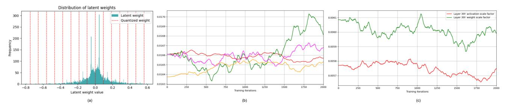
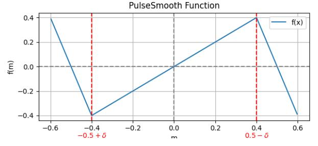
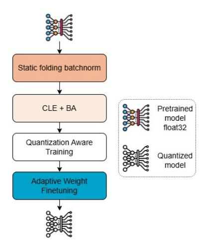

# Stability-Driven Quantization-Aware Training for Low-Bit Models

Du Tran-Ngoc *Viettel Semiconductor Center* Hanoi, Vietnam dutn1@viettel.com.vn

Quang Le-Hoang-Minh *Viettel Semiconductor Center* Hanoi, Vietnam quanglhm@viettel.com.vn

Trung Quang-Dong\* *Viettel Semiconductor Center* Hanoi, Vietnam trungdq8@viettel.com.vn

Thang Nguyen-Minh\* *Viettel Semiconductor Center* Hanoi, Vietnam thangnm35@viettel.com.vn

*Abstract*—Quantization-Aware Training QAT has gained significant attention thanks to reduced memory usage and accelerated inference, which are achieved by transforming fullprecision models to low-bit integer formats while preserving accuracy. However, applying QAT to ultra-low precision (e.g., 4-bit or 3-bit) can lead to severe accuracy degradation due to the improper weights and quantization parameters during training. In this paper, we present a comprehensive analysis of the root causes of accuracy degradation in low-bit QAT. Based on the analysis, we propose three novel techniques — Gradient Scaling-Aware Distance, EMA-Aware Distance, and Adaptive Fine-Tuning Weight that effectively mitigate quantization noise without adding inference overhead. Experimental results demonstrate that our method outperforms existing QAT approaches. In 4-bit quantization, our method reduces quantization errors by approximately 2% on the object detection task for MS COCO and 0.7% on image classification for ImageNet1k.

*Index Terms*—Quantization-aware training, Oscillation, Deep Neural Network

#### I. INTRODUCTION

In recent years, the increasing demand to deploy deep neural networks (DNNs) on resource-constrained devices has gained attention into model compression techniques [1] [2] [3]. Quantization, which reduces the precision of the model's weights and activations, has proven to be an effective approach for improving model performance. Although quantization offers benefits in computational efficiency and reduced latency, it introduces quantization noise due to lowered numerical precision. However, Post-training quantization (PTQ) [4] can effectively reduce model precision to 8 bits with minimal accuracy drop. PTQ requires only a small calibration dataset to find quantization parameters, but accuracy performance deteriorates significantly with fewer bits, e.g., 4 bits, 3 bits.

To overcome the limitations of PTQ, Quantization-Aware Training (QAT) [5] has been proposed. By inserting virtual quantization layers into DNN, QAT integrates quantization effects into the training process to maintain high accuracy even at low bit widths. Due to the non-differentiable rounding operation of virtual quantization, Straight-Through Estimator (STE) [6] is adopted to enable gradient-based optimization. However, studies [7] [8] highlight that using STE may face unstable optimization due to oscillation during training. When using STE, the weights fluctuate between neighboring quantization levels, resulting in optimization noise throughout the training process [8]. Recent works [9] [10] propose smooth approximations to replace STE for stable training, but STE remains the de facto approach due to its simplicity. Learned Step Size Quantization (LSQ) [11] leverages STE-based gradient approximation to optimize the scaling factor, thereby preserving accuracy under low-bit quantization. In addition, the rounding operation in virtual quantization draws increasing attention due to its impact on training stability.

Rounding to the nearest is the most widely used rounding method in neural network quantization. However, it becomes suboptimal when applied to low-bit quantization [1]. Furthermore, the authors of [7] observed that the threshold of a half in rounding-to-nearest also leads to training oscillation, resulting in performance degradation. To overcome these challenges, the authors of [7] propose an Exponential Moving Average (EMA) based method to reduce the oscillation in the training process. The work [8] introduces a regularized loss for controlling the weights in the non-oscillating state. Some works [12] [13] propose learnable rounding schemes to minimize rounding errors during training. However, the underlying causes of the oscillation remain unexplored.

In this paper, we propose several contributions to tackle the oscillation problem in QAT as below:

- We provide theoretical and empirical analyses for quantization-aware training.
- We propose a method called Gradient Scaling-Aware Distance (ScaleGrad) and EMA-Aware Distance for updating weights (EAM) to address the problem of instability in the QAT training process.
- We propose an Adaptive Finetuning Weight (AFW) to fine-tune the oscillating weights.

# II. RELATED WORK

### *A. Quantization Aware Training*

Quantization-aware training (QAT) has been extensively studied for its ability to minimize accuracy degradation when converting models to low-precision formats by incorporating quantization into the training process. Techniques such as Element-Wise Gradient Scaling (EWGS) [14] and Learned Step Size Quantization (LSQ) [11] propose to enhance training stability and mitigate the impact of quantization. QAT typically relies on STE to enable gradient-based optimization despite the non-differentiability of quantization operations; however, the effectiveness of STE remains a topic of debate. To address its limitations, alternative approaches such as mirror descent [14], gradient bias correction [15], and smooth approximations [9], [10] have been introduced. Although QAT generally achieves higher accuracy compared to post-training quantization (PTQ), it often incurs significantly longer training times.

#### B. Oscillations in Quantization-Aware training

One critical challenge of STE-based QAT is the oscillation in weight. Recent studies [8], [16] show that the approximation error introduced by STE can lead to instability during training. To address the issue, the approach in [16] replaces the quantization operation with an additive Gaussian noise to mimic quantization effects while avoiding oscillatory behavior. Similarly, the authors of [8] find that oscillations particularly worsen in lightweight architectures employing depth-wise convolutions. They propose to constrain the latent weights either by regularizing them toward quantized values or by freezing them entirely. More recently, [17] investigates the oscillation in vision transformers and introduces fixed scaling factors along with a reparameterization of the query-key mechanism to mitigate these effects. However, their method is designed for transformer-based architectures.

# III. ANALYSIS OF OSCILLATION IN QUANTIZATION-AWARE TRAINING

This section investigates oscillations in QAT through theoretical analysis and empirical observations.

#### A. Quantization Aware Training Analysis

We formulate the Quantization function with latent value x - input and output  $\hat{x}$  as follows:

$$\bar{x} = clip\left(\left\lceil \frac{x}{s} \right\rceil, \alpha, \beta\right) \tag{1}$$

$$\hat{x} = s \times \bar{x} \tag{2}$$

where s is the scaling factor,  $\alpha$  and  $\beta$  denote the lower and upper bounds based on bitwidth, respectively,  $\lceil \cdot \rceil$  denotes the rounding-to-nearest operation whose derivative is approximated by 1 in the backward pass by the Straight-Through Estimator (STE) [6], with the following formula:

$$\frac{\partial L}{\partial x} = \begin{cases} \frac{\partial L}{\partial \hat{x}} & \text{if } \frac{x}{s} \in [\alpha, \beta] \\ 0 \end{cases}$$
 (3)

where L is the target loss. During training, weights and activations are quantized in the forward pass by (1), considering the effects of quantization errors. Scaling factor s can be either precomputed or jointly optimized with the model parameters [11], [18]. Unfortunately, STE degrades the accuracy of QAT at lower-bit formats.

Next, we mathematically analyze the high probability causes of the degradation and propose methods to improve performance in the following sections. Firstly, we analyze the gradient concerning the scaling factor of the loss function, as outlined below:

$$\frac{\partial L}{\partial s} = \sum_{i}^{K} \frac{\partial L}{\partial \hat{x}_{i}} \frac{\partial \hat{x}_{i}}{\partial s} \tag{4}$$

with:

$$\frac{\partial \hat{x}_i}{\partial s} = \begin{cases}
\alpha & \text{if } \frac{x_i}{s} \le \alpha \\
(\lceil \frac{x_i}{s} \rceil - \frac{x_i}{s}) & \text{if } \frac{x_i}{s} \in [\alpha, \beta] \\
\beta & \text{if } \frac{x_i}{s} \ge \beta
\end{cases}$$
(5)

From (5), it can be seen that term  $\left(\left\lceil\frac{x_i}{s}\right\rceil-\frac{x_i}{s}\right)$  is a discontinuous function. Specifically, when  $\frac{x_i}{s}$  nears k+0.5, which is a transition point, the term experiences a surge with maximum amplitude. For example, when  $\frac{\partial L}{\partial \hat{x}^t}>0$  and approximately constant with value  $\varepsilon$ , and x<0 over an interval of  $T_0$  iterations  $[t,t+T_0]$ . At iteration t, assume that  $\frac{x_i^t}{s^t}$  is approaching the left side of a transition point, i.e.,

$$\frac{x_i^t}{s^t} \to k + 0.5^- \tag{6}$$

In this situation, the gradient with respect to the scaling factor becomes  $\frac{\partial L}{\partial s^t} \approx -0.5\varepsilon < 0$ . After the gradient descent update, the new value  $s^{t+1}$  is:  $s^{t+1} = s^t - lr.\frac{\partial L}{\partial s^t} > s^t$ . So, at iteration t+1, we have given as:

$$\frac{x_i^t}{s^t} < \frac{x_i^{t+1}}{s^{t+1}} \to k + 0.5^+ \tag{7}$$

$$\frac{\partial L}{\partial s^{t+1}} \approx 0.5\varepsilon > 0 \tag{8}$$

Here,  $\rightarrow$  indicates approaching a value, while  $k+0.5^+$  and  $k+0.5^-$  denote right-sided and left-sided neighborhoods of k+0.5. Equations (6), (7), and (8) show that the gradient of loss with respect to the scaling factor can fluctuate during training. Since  $x_i$  includes both weights and activations, such instability leads to oscillations, thus degrading model performance.

The latent weight oscillation during QAT is also determined from the nature of its gradients. As shown in (3), the gradient depends on the occurrence of a quantization level transition rather than the latent weight's value. So, when  $\left|\left\lceil\frac{x_i}{s}\right\rceil - \frac{x_i}{s}\right|$  is small, gradient updates may not be large enough to change the latent weight. Thus, such updates fail to reduce total loss and optimize the model parameters effectively.

#### B. Observing Oscillations in QAT

In this section, we examine the oscillation during quantization-aware training of DNNs using YOLOv8n model [19]. We perform QAT on YOLOv8n using learnable scaling factors, following [11], until the model's mAP shows minimal further improvement. Fig. 1(a) shows the histogram of latent weights in the 2th layer. A large proportion of weights are concentrated near the quantization thresholds, which indicates a high probability of oscillations between adjacent quantization levels. This phenomenon is further illustrated in Fig. 1(b), where the latent weights have chaotic oscillation.

To observe the oscillation of the scaling factor, the model weights are frozen after training, and the scaling factors are

Fig. 1: The oscillation of the weights of the YOLOv8-n model in the last 2000 iterations: (a) latent weight histogram on the  $2^{th}$  layer, (b) weight fluctuations in the  $2^{th}$  layer's first channel, and (c) scaling factor dynamics in the 3rd layer.

TABLE I: YOLOv8-n performance under LSQ training and training with frozen weights and learnable scaling factors.

| Method       |               | YOLOv8-n |
|--------------|---------------|----------|
| Origin Model | 32bit         | 37.3     |
| Baseline     | LSQ           | 32.1     |
| Freeze       | Freeze weight | 31.7     |

Fig. 2: The proposed PulseSmooth function, the x-axis represents the value of m in the range from -0.5 to 0.5. Note that when m is in the range  $(-0.5+\delta, 0.5-\delta)$  the PulseSmooth function is an identity function.

updated via the backpropagation algorithm. Fig. 1(c) shows that, despite a small learning rate, the scaling factor of weight and activation fluctuates around the initial value. Such an instability is more severe in early layers, where gradient fluctuations accumulate due to the chain rule. The results in Table I show a noticeable drop in the model's mAP compared to the baseline, emphasizing the issue.

#### IV. METHODOLOGY

This section presents proposed methods to reduce oscillations and improve QAT stability. The first two methods are applied during training, and the third one is a post-processing step for fine-tuning performance.

#### A. Gradient Scaling Distance-aware

We propose a function to solve the discontinuous behavior as discussed in Sec.III-A, called PulseSmooth, as depicted in Fig. 2. PulseSmooth allows for smoother gradient transitions. We mathematically model the proposed method as follows. Let  $X \in \mathbb{R}^*$  denote the latent weight or activation tensor, and  $s \in \mathbb{R}$  be the scaling factor. We define that  $m = \left( \left\lceil \frac{X}{s} \right\rceil - \frac{X}{s} \right)$ 

and  $m \in (-0.5, 0.5)$ , and let  $\delta$  be the continuous control parameter. *PulseSmooth* function, denoted as  $F_{ps}$ , is formulated as follows:

$$F_{ps}(m) = \begin{cases} -\frac{0.5 - \delta}{\delta}(m + 0.5) & \text{if } m \in (-0.5, -0.5 + \delta] \\ m & \text{if } m \in [-0.5 + \delta, 0.5 - \delta] \\ -\frac{0.5 - \delta}{\delta}(m - 0.5) & \text{if } m \in [0.5 - \delta, 0.5) \end{cases}$$

Our idea is that m has a smoother transition using  $\delta$ . When m approaches  $0.5-\delta$  or  $-0.5+\delta$ , it has a gradual change in amplitude, while the sign remains unchanged. Therefore, the PulseSmooth function reduces the abrupt changes in the gradient of the scaling factor s, while still preserving the directional characteristics of the original pulse function. The gradient for the loss function is given by:

$$\frac{\partial L}{\partial s} = \sum_{i}^{N_x} \frac{\partial L}{\partial \hat{x}_i} F_{ps} \left( \frac{\partial \hat{x}_i}{\partial s} \right).$$

We note that, when the gradient force is weak, the latent weight stays unchanged at a quantization level. So, we propose a method of scaling the gradients of the latent weight according to the distance-aware factor for more stable convergence. The proposed scaling function is given as:

Fscale(w) = 
$$e^{-k \cdot \Delta}$$
  

$$\Delta = \left| \left\lceil \frac{w}{s} \right| - \frac{w}{s} \right| \in [0, 0.5)$$
(9)

where k controls the scaling function. The gradient of the latent weight after scaling is as follows:

$$\frac{\partial L}{\partial w} = \begin{cases} \frac{\partial L}{\partial \hat{w}} \cdot \text{Fscale}(\mathbf{w}) \text{ if } \frac{w}{s} \in [\alpha, \beta] \\ 0 \end{cases}$$
 (10)

Equations (9) and (10) show that when a latent weight is far from the quantization threshold, Fscale has a large value to push the update process. Meanwhile, for the latent weights near the quantization threshold, a smaller value of Fscale does not affect their update process; it is non-trivial to switch to a new state to change the overall loss. As a result, this leads to a more balanced and stable learning.

Fig. 3: The training flow of the proposed method.

#### B. EMA Aware distance for Updating weight

To further mitigate the oscillations of weights and scaling factors during the QAT process, we propose a distance-aware Exponential Moving Average (EMA) method. As the training process approaches convergence, weights with quantized values far from the latent weight highly oscillate between two adjacent quantization levels. Therefore, those weights can have a larger EMA smoothing factor to stabilize the update process. In contrast, weights far from the quantization threshold have a lower chance of changing quantization levels. So, a smaller smoothing factor can use the latest updates from target loss, which benefits overall performance. The update formula for the latent weight W of  $l^{th}$  layer at  $t^{th}$  iteration is as follows:

$$W_t^l = \alpha W_{t-1}^l + (1 - \alpha) W_t^l$$

$$\alpha = \begin{cases} k \cdot |W_t^l - \hat{W}_t^l| & \text{if } t > \tau \\ 0 & \text{else} \end{cases}$$
(11)

The the scaling factor of activation  $s_a$  and weight  $s_W$  in the  $l^{th}$  layer is updated during training is as follows:

$$\begin{split} s_{W(t)}^{l} &= (1 - \mu) s_{W(t-1)}^{l} + \mu s_{W(t)}^{l} \\ s_{a(t)}^{l} &= (1 - \mu) s_{a(t-1)}^{l} + \mu s_{a(t)}^{l} \\ \mu &= (1 - \frac{t - \tau}{epoch - \tau}) \mu_{init} \end{split} \tag{12}$$

Where  $\tau$  and k are hyperparameters representing the iteration milestone at which the EMA update process is activated and the corresponding scale factor, respectively.  $\mu_{init}$  is initial smoothing coefficient used for updating of the scaling factor.

#### C. Adaptive Finetuning Weight

In this section, we propose a post-processing for the quantized model to fine-tune weights that exhibit strong oscillations after training, aiming to help the model reach a better performance. To identify which weights should be adjusted during this stage, we track their state and sign transitions throughout training using the frequency tracking metric [8]. Weights that switch between adjacent quantization levels are frozen during

training and later fine-tuned in a post-processing step. We formulate the following optimization problem as follows:

$$\theta = \underset{\theta}{\operatorname{argmin}} \ L(F(W, \theta)) + \lambda R(\theta) \tag{13}$$

where  $F(W, \theta)$  is the quantization function applied to the weights selected for finetuning, parameterized by the learnable variable  $\theta$ , and is defined as follows:

$$F(W,\theta) = s.clip\left(\left\lceil \frac{W}{s} \right\rfloor + g(\theta), \alpha, \beta\right)$$
$$g(\theta) = clip(\gamma \cdot \tanh(\theta), -1, 1)$$
 (14)

where  $\gamma$  is a scaling hyperparameter, and  $\lambda$  is a loss-balancing parameter.  $R(\theta)$  is a regularization term that constrains the quantity  $g(\theta)$  to take values only in -1,0,1, formulated as follows:

$$R(\theta) = g(\theta)^{2} \cdot ((1 - g(\theta)^{2})^{2}$$
(15)

Unlike Adaround [12], which applies floor operations uniformly to all W/s terms and may disrupt the model state, our method preserves quantized weights and refines them using a learnable offset  $g(\theta)$ , defined as a clipped tanh function bounded in [-1,1] (Eq. 14). As shown in Table II and Table V, our method outperforms both weight-freezing and Adaround.

#### V. EXPERIMENT

To evaluate the effectiveness of the proposed methods, we conduct experiments focusing on lightweight models, such as YOLO, MobileNet, EfficientNet, and ResNet18, which are commonly deployed on resource-constrained hardware. To highlight the capability of our methods under low-bit quantization, we apply 3-bit and 4-bit quantization to both weights and activations.

**Experiment setup:** Full flow of the proposed quantization method is illustrated in Fig. 3. Following [3], we first fold Conv-BatchNorm-ReLU layers in the pretrained model. Then, we apply LSQ per-tensor quantization to both weights and activations. To improve quantization performance, we use Cross-Layer Equalization (CLE) and Bias Correction [20], and initialize activation scales with the Moving Average Min-Max method [21] on the validation set. We perform QAT for 80 epochs using ScaleGrad, 20 epochs for EAM with  $\alpha_{init}=0.1$ , and 10 epochs for AFM, employing the SGD optimizer with a learning rate of 0.001, momentum of 0.9, weight decay of 1e-5,  $\gamma$  and  $\lambda$  set to 1.1 and 0.1, respectively and a StepLR learning rate scheduler. All experiments use PyTorch 11.12 on an NVIDIA V100 GPU.

#### A. Experiment result

1) Quantity result of proposed method: We conduct experiments to evaluate the proposed method on two benchmark datasets: MS COCO and ImageNet, using a diverse set of CNN architectures.

As shown in Table III, on the image classification task, our proposed quantization method significantly reduces the accuracy gap between quantized models and full-precision models. Under 4-bit quantization, the accuracy gap between

TABLE II: The comparative results between the proposed method and other quantization-aware training approaches on both object detection and object classification tasks.

| Task | Model           | FP   | LSQ [11] |      | PerChannel [3] |      | Damp [8] |      | RedYolo [7] |      | Ours        |      |
|------|-----------------|------|----------|------|----------------|------|----------|------|-------------|------|-------------|------|
|      |                 |      | 4a4w     | 3a3w | 4a4w           | 3a3w | 4a4w     | 3a3w | 4a4w        | 3a3w | 4a4w        | 3a3w |
|      | YOLOX-T         | 32.8 | 27.5     | 21.3 | 28.2           | 22.1 | 28.5     | 22.7 | 28.1        | 23.6 | 29.3        | 24.8 |
| OD   | YOLOv8-n        | 37.3 | 32.1     | 27.9 | 32.4           | 27.5 | 32.9     | 29.3 | 33.3        | 28.4 | 34.2        | 30.1 |
| OD   | YOLOv9-t        | 38.3 | 31.8     | 26.8 | 32.8           | 28.7 | 32.4     | 29.0 | 33.6        | 27.3 | 34.1        | 29.7 |
|      | YOLOv9-s        | 46.8 | 41.8     | 38.1 | 42.2           | 38.1 | 43.1     | 38.5 | 42.6        | 39.2 | 44.5        | 41.9 |
|      | MobileNetV1     | 70.6 | 67.6     | 64.7 | 67.7           | 65.2 | 68.2     | 65.7 | 68.7        | 66.1 | 69.2        | 66.6 |
| CLS  | MobileNetV2     | 72.0 | 69.5     | 65.3 | 70.5           | 67.9 | 70.6     | 67.8 | 70.4        | 67.6 | 71.1        | 68.2 |
|      | EffictionNet-B0 | 77.1 | 75.9     | 73.2 | 76.3           | 73.4 | 76.1     | 73.5 | 75.6        | 73.1 | 76.4        | 74.1 |
|      | MobileNeXt-x1.4 | 76.1 | 74.3     | 71.8 | 74.2           | 71.8 | 74.9     | 72.0 | 74.7        | 72.3 | <b>75.1</b> | 72.8 |

TABLE III: The experimental results of the proposed method on various lightweight classification models evaluated on the ImageNet1K dataset.

| Model                 | Param (M)  | Acc. | Method |      |  |
|-----------------------|------------|------|--------|------|--|
| Wiodei                | raram (wi) | Acc. | 4A4W   | 3A3W |  |
| MobileNetV1 [22]      | 4.2M       | 70.6 | 69.2   | 66.6 |  |
| MobileNetV2 [23]      | 3.4M       | 72.0 | 71.1   | 68.2 |  |
| MobileNetV3-L [24]    | 5.4M       | 75.3 | 73.7   | 72.0 |  |
| MobileNeXt-x1.4 [25]  | 6.1M       | 76.2 | 75.1   | 72.8 |  |
| EffictionNet-B0 [26]  | 5.3 M      | 77.1 | 76.4   | 74.1 |  |
| ShuffleNetV2-1.0 [27] | 2.3M       | 69.5 | 67.9   | 65.8 |  |
| Resnet18 [28]         | 11.7M      | 69.8 | 68.6   | 66.4 |  |
| SE-ResNet-50 [29]     | 25.6M      | 76.7 | 76.0   | 73.7 |  |
| VGG-16 [30]           | 138M       | 72.9 | 72.5   | 71.2 |  |

TABLE IV: Experimental results of the proposed method on different lightweight object detection models are evaluated on the MSCOCO dataset.

| Model                 | Param (M)   | mAP  | Method |      |  |
|-----------------------|-------------|------|--------|------|--|
| Wodel                 | i aram (wi) | шлі  | 4A4W   | 3A3W |  |
| MobileNet SSD V2 [31] | 3.4M        | 25.7 | 22.6   | 19.7 |  |
| YOLOX-Nano [32]       | 0.9M        | 26.1 | 19.8   | 14.3 |  |
| YOLOX-Tiny [32]       | 5.1M        | 32.8 | 29.3   | 24.8 |  |
| YOLOv8-n [19]         | 3.2M        | 37.3 | 34.2   | 30.1 |  |
| YOLOv8-s [19]         | 11.2M       | 44.9 | 42.5   | 39.6 |  |
| YOLOv8-m [19]         | 25.9M       | 50.2 | 47.9   | 45.8 |  |
| YOLOv9-t [33]         | 2.0M        | 38.3 | 34.1   | 29.7 |  |
| YOLOv9-s [33]         | 7.1M        | 46.8 | 44.5   | 41.9 |  |

quantized and original models keeps below 1.6%, and within 4% for 3 bits. Larger models like VGG16 and SE-ResNet-50 show less than 1% drop, confirming the method's effectiveness on deeper networks.

For object detection (Table IV), our method shows a high mAP score on lightweight detectors like YOLO and SSD. For instance, YOLOv8-s and YOLOv9-s maintain under 2.5% loss at 4 bits and around 5% at 3 bits. This presents a favorable trade-off for edge deployment, offering up to 8× memory savings with minimal accuracy loss.

2) Comparison of results with other methods: We compare our method with existing QAT approaches LSQ, Per-Channel Quantization, Damping Loss, and RedYolo—on both object detection (using lightweight YOLO models) and classification (using MobileNet and EfficientNet variants). As shown in Table II, our method outperforms all baselines in 4 bits and 3 bits settings. Compared to LSQ, it achieves more than 2%

TABLE V: Table of ablation impact of each proposed method on the overall results. The symbols "-" and  $\checkmark$  indicate that the method was not used and was used, respectively.

|           | Me           | thod         |          | Bit |         | Model   |         |
|-----------|--------------|--------------|----------|-----|---------|---------|---------|
| ScaleGrad | EAD          | AFW          | AdaRound | a/w | YOLOv8n | Yolov9t | MBNetV2 |
| -         | -            | -            | -        |     | 32.1    | 31.8    | 69.5    |
| ✓         | -            | -            | -        |     | 33.7    | 33.6    | 70.4    |
| ✓         | ✓            | -            | -        | 4   | 34.0    | 33.2    | 70.8    |
| ✓         | ✓            | -            | ✓        |     | 33.8    | 33.7    | 70.5    |
| ✓         | $\checkmark$ | $\checkmark$ | -        |     | 34.2    | 34.1    | 71.1    |
| -         | -            | -            | -        |     | 27.9    | 26.8    | 65.3    |
| ✓         | -            | -            | -        |     | 28.7    | 29.3    | 67.3    |
| ✓         | ✓            | -            | -        | 3   | 29.6    | 29.3    | 67.6    |
| ✓         | ✓            | -            | ✓        |     | 29.6    | 29.2    | 67.4    |
| ✓         | ✓            | ✓            | -        |     | 30.1    | 29.7    | 68.2    |

improvement in most models, including a 2.7% mAP gain in YOLOv9-s and a 1.6% top-1 accuracy boost in MobileNetV1. It also outperforms Damping Loss by over 1% at 4 bits and 2% at 3 bits. Unlike Per-Channel Quantization and RedYolo, our method avoids extra channel-wise parameters, maintaining compatibility with hardware accelerators while achieving better overall performance.

#### B. Ablation Study

We conduct ablation studies on lightweight models to assess the impact of each proposed algorithm on quantization performance. As shown in Table V, all methods improve upon baseline LSQ (first row). ScaleGrad consistently boosts performance by over 1% by smoothing gradients. Adding EAD yields further gains, for instance, EfficientNet-B0 witnesses a 0.8% accuracy increase. AFW provides the highest improvements, with YOLOv9-t gaining 2.3% at 4-bit and 2.9% at 3-bit quantization. Notably, AFW outperforms AdaRound, which in some cases slightly degrades performance (e.g., YOLOv8-n drops 0.2% mAP). These results confirm that combining AFW with ScaleGrad and EAD yields the best low-bit quantization results.

#### VI. CONCLUSION

In this paper, we conduct a comprehensive analysis of oscillation phenomena in low-bit Quantization-Aware Training, combining both theoretical insights and empirical observations. We find that the key causes of instability and suboptimal convergence of QAT due to the abrupt fluctuations in the gradient of scaling factors and the dependency of latent weight gradients on quantization transitions rather than their values.

To address these issues, we propose three techniques: Gradient Scaling Aware Distance (ScaleGrad), EMA Aware Distance for Update Weight (EAM), and Adaptive Finetuning Weight (AFW). Our methods stabilize training dynamics and improve performance for classification and object detection tasks with 4 bits and 3 bits of quantization. They do not introduce extra computational overhead during inference, making them practical for resource-constrained deployment. The future work aims to develop the AFW method to support end-to-end integration during training and further enhance quantization performance.

#### ACKNOWLEDGMENT

This research is funded by Viettel Group.

## REFERENCES

- [1] R. Banner, Y. Nahshan, and D. Soudry, "Post training 4-bit quantization of convolutional networks for rapid-deployment," *Advances in Neural Information Processing Systems*, vol. 32, 2019.
- [2] M. Nagel, M. v. Baalen, T. Blankevoort, and M. Welling, "Datafree quantization through weight equalization and bias correction," in *Proceedings of the IEEE/CVF international conference on computer vision*, pp. 1325–1334, 2019.
- [3] M. Nagel, M. Fournarakis, R. A. Amjad, Y. Bondarenko, M. Van Baalen, and T. Blankevoort, "A white paper on neural network quantization," *arXiv preprint arXiv:2106.08295*, 2021.
- [4] J. Choi, Z. Wang, S. Venkataramani, P.-J. Chuang, V. Srinivasan, and K. Gopalakrishnan, "Pact: Parameterized clipping activation for quantized neural networks," *Preprint arXiv:1805.06085*, 2018.
- [5] B. Jacob, S. Kligys, B. Chen, M. Zhu, M. Tang, A. Howard, H. Adam, and D. Kalenichenko, "Quantization and training of neural networks for efficient integer-arithmetic-only inference," in *Proceedings of the IEEE conference on computer vision and pattern recognition*, 2018.
- [6] Y. Bengio, N. Leonard, and A. Courville, "Estimating or propagating ´ gradients through stochastic neurons for conditional computation," *arXiv preprint arXiv:1308.3432*, 2013.
- [7] K. Gupta and A. Asthana, "Reducing the side-effects of oscillations in training of quantized yolo networks," in *Proceedings of the IEEE/CVF Winter Conference on Applications of Computer Vision*, 2024.
- [8] M. Nagel, M. Fournarakis, Y. Bondarenko, and T. Blankevoort, "Overcoming oscillations in quantization-aware training," in *International Conference on Machine Learning*, pp. 16318–16330, PMLR, 2022.
- [9] R. Gong, X. Liu, S. Jiang, T. Li, P. Hu, J. Lin, F. Yu, and J. Yan, "Differentiable soft quantization: Bridging full-precision and low-bit neural networks," in *Proceedings of the IEEE/CVF international conference on computer vision*, pp. 4852–4861, 2019.
- [10] J. Yang, X. Shen, J. Xing, X. Tian, H. Li, B. Deng, J. Huang, and X.-s. Hua, "Quantization networks," in *Proceedings of the IEEE/CVF conference on computer vision and pattern recognition*, 2019.
- [11] S. K. Esser, J. L. McKinstry, D. Bablani, R. Appuswamy, and D. S. Modha, "Learned step size quantization," *arXiv preprint arXiv:1902.08153*, 2019.
- [12] M. Nagel, R. A. Amjad, M. Van Baalen, C. Louizos, and T. Blankevoort, "Up or down? adaptive rounding for post-training quantization," in *International conference on machine learning*, PMLR, 2020.
- [13] J. H. Lee, J. Kim, S. J. Kwon, and D. Lee, "Flexround: Learnable rounding based on element-wise division for post-training quantization," in *International Conference on Machine Learning*, PMLR, 2023.
- [14] J. Lee, D. Kim, and B. Ham, "Network quantization with elementwise gradient scaling," in *Proceedings of the IEEE/CVF conference on computer vision and pattern recognition*, pp. 6448–6457, 2021.
- [15] J. Lee, D. Kim, and B. Ham, "Network quantization with elementwise gradient scaling," in *Proceedings of the IEEE/CVF conference on computer vision and pattern recognition*, pp. 6448–6457, 2021.
- [16] A. Defossez, Y. Adi, and G. Synnaeve, "Differentiable model compres- ´ sion via pseudo quantization noise," *Preprint arXiv:2104.09987*, 2021.
- [17] S.-Y. Liu, Z. Liu, and K.-T. Cheng, "Oscillation-free quantization for low-bit vision transformers," in *International conference on machine learning*, pp. 21813–21824, PMLR, 2023.

- [18] Y. Bhalgat, J. Lee, M. Nagel, T. Blankevoort, and N. Kwak, "Lsq+: Improving low-bit quantization through learnable offsets and better initialization," in *Proceedings of the IEEE/CVF conference on computer vision and pattern recognition workshops*, pp. 696–697, 2020.
- [19] M. Sohan, T. Sai Ram, and C. V. Rami Reddy, "A review on yolov8 and its advancements," in *International Conference on Data Intelligence and Cognitive Informatics*, pp. 529–545, Springer, 2024.
- [20] M. Nagel, M. v. Baalen, T. Blankevoort, and M. Welling, "Datafree quantization through weight equalization and bias correction," in *Proceedings of the IEEE/CVF international conference on computer vision*, pp. 1325–1334, 2019.
- [21] M. Fournarakis and M. Nagel, "In-hindsight quantization range estimation for quantized training," in *Proceedings of the IEEE/CVF conference on computer vision and pattern recognition*, pp. 3063–3070, 2021.
- [22] A. G. Howard, M. Zhu, B. Chen, D. Kalenichenko, W. Wang, T. Weyand, M. Andreetto, and H. Adam, "Mobilenets: Efficient convolutional neural networks for mobile vision applications," *arXiv preprint arXiv:1704.04861*, 2017.
- [23] M. Sandler, A. Howard, M. Zhu, A. Zhmoginov, and L.-C. Chen, "Mobilenetv2: Inverted residuals and linear bottlenecks," in *Proceedings of the IEEE conference on computer vision and pattern recognition*, pp. 4510–4520, 2018.
- [24] A. Howard, M. Sandler, G. Chu, L.-C. Chen, B. Chen, M. Tan, W. Wang, Y. Zhu, R. Pang, V. Vasudevan, *et al.*, "Searching for mobilenetv3," in *Proceedings of the IEEE/CVF international conference on computer vision*, pp. 1314–1324, 2019.
- [25] D. Zhou, Q. Hou, Y. Chen, J. Feng, and S. Yan, "Rethinking bottleneck structure for efficient mobile network design," in *Computer Vision– ECCV 2020: 16th European Conference, Glasgow, UK, August 23–28, 2020, Proceedings, Part III 16*, pp. 680–697, Springer, 2020.
- [26] M. Tan and Q. Le, "Efficientnet: Rethinking model scaling for convolutional neural networks," in *International conference on machine learning*, pp. 6105–6114, PMLR, 2019.
- [27] N. Ma, X. Zhang, H.-T. Zheng, and J. Sun, "Shufflenet v2: Practical guidelines for efficient cnn architecture design," in *Proceedings of the European conference on computer vision (ECCV)*, pp. 116–131, 2018.
- [28] K. He, X. Zhang, S. Ren, and J. Sun, "Deep residual learning for image recognition," in *Proceedings of the IEEE conference on computer vision and pattern recognition*, pp. 770–778, 2016.
- [29] J. Hu, L. Shen, and G. Sun, "Squeeze-and-excitation networks," in *Proceedings of the IEEE conference on computer vision and pattern recognition*, pp. 7132–7141, 2018.
- [30] K. Simonyan and A. Zisserman, "Very deep convolutional networks for large-scale image recognition," *arXiv preprint arXiv:1409.1556*, 2014.
- [31] G. Ramesh, Y. Jeswin, R. R. Divith, S. BR, K. Kiran Raj, *et al.*, "Real time object detection and tracking using ssd mobilenetv2 on jetbot gpu," in *2024 IEEE International Conference on Distributed Computing, VLSI, Electrical Circuits and Robotics (DISCOVER)*, pp. 255–260, IEEE, 2024.
- [32] Z. Ge, S. Liu, F. Wang, Z. Li, and J. Sun, "Yolox: Exceeding yolo series in 2021," *arXiv preprint arXiv:2107.08430*, 2021.
- [33] C.-Y. Wang, I.-H. Yeh, and H.-Y. Mark Liao, "Yolov9: Learning what you want to learn using programmable gradient information," in *European conference on computer vision*, pp. 1–21, Springer, 2024.